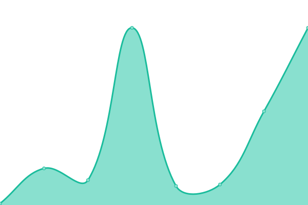
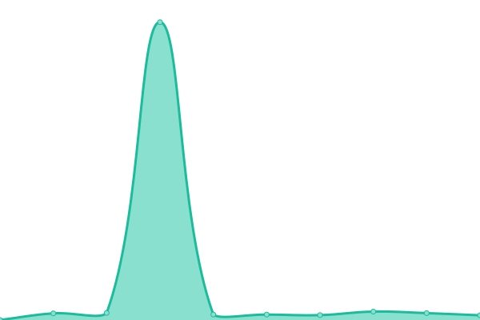

# [📈 Live Status](https://pvinis.github.io/upptime): <!--live status--> **🟩 All systems operational**

This repository contains the open-source uptime monitor and status page for [Pavlos Vinieratos](pavlos.dev), powered by [Upptime](https://github.com/upptime/upptime).

With [Upptime](https://upptime.js.org), you can get your own unlimited and free uptime monitor and status page, powered entirely by a GitHub repository. We use [Issues](https://github.com/pvinis/upptime/issues) as incident reports, [Actions](https://github.com/pvinis/upptime/actions) as uptime monitors, and [Pages](https://pvinis.github.io/upptime) for the status page.

<!--start: status pages-->
<!-- This summary is generated by Upptime (https://github.com/upptime/upptime) -->
<!-- Do not edit this manually, your changes will be overwritten -->
<!-- prettier-ignore -->
| URL | Status | History | Response Time | Uptime |
| --- | ------ | ------- | ------------- | ------ |
|  [p0l.co](https://p0l.co) | 🟩 Up | [p0l-co.yml](https://github.com/pvinis/upptime/commits/HEAD/history/p0l-co.yml) | 

 672ms
     
 | 

<a href="https://pvinis.github.io/upptime/history/p0l-co">100.00%</a>
    

|  [pvin.is](https://pvin.is) | 🟩 Up | [pvin-is.yml](https://github.com/pvinis/upptime/commits/HEAD/history/pvin-is.yml) | 

 21ms
     
 | 

<a href="https://pvinis.github.io/upptime/history/pvin-is">100.00%</a>
    

|  [michi.land](https://michi.land) | 🟩 Up | [michi-land.yml](https://github.com/pvinis/upptime/commits/HEAD/history/michi-land.yml) | 

 803ms
     
 | 

<a href="https://pvinis.github.io/upptime/history/michi-land">100.00%</a>
    

|  [Echo Artsy](https://echo.artsy.net/Echo.json) | 🟩 Up | [echo-artsy.yml](https://github.com/pvinis/upptime/commits/HEAD/history/echo-artsy.yml) | 

 190ms
     
 | 

<a href="https://pvinis.github.io/upptime/history/echo-artsy">100.00%</a>
    

<!--end: status pages-->

[**Visit our status website →**](https://pvinis.github.io/upptime)

## 📄 License

- Powered by: [Upptime](https://github.com/upptime/upptime)
- Code: [MIT](./LICENSE) © [Pavlos Vinieratos](pavlos.dev)
- Data in the `./history` directory: [Open Database License](https://opendatacommons.org/licenses/odbl/1-0/)
